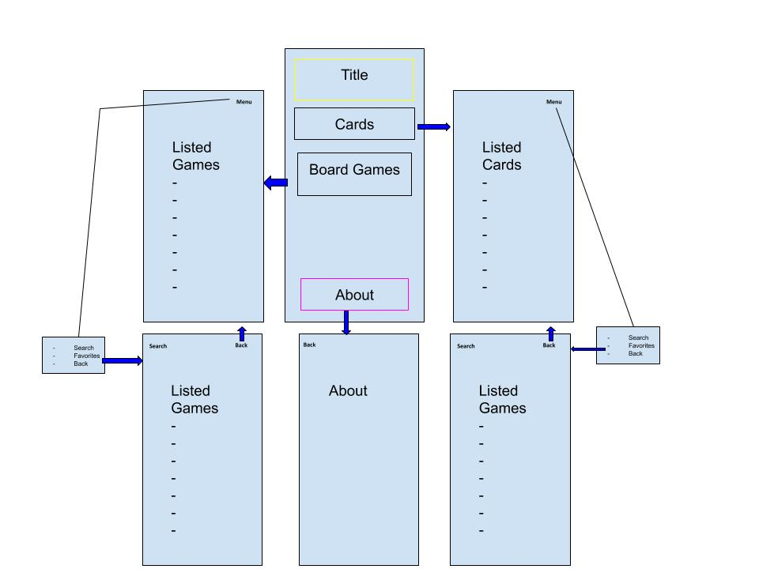

# Beer Me

This project will focus on being able to catalogue beers you may have tried. It will allow users to input beers they tried with various specs and give commentary about their experience for reference. Since this application is specifically designed to work on the users phone it will allow the user to access their geolocation and find nearby breweries for their next conquest.  If something stands out in style or look then this app will allow the user to access their camera and take a picture to save for later viewing.

# The Code

<Insert Code Snippets Here>

# General Outline

## Known Bugs
TBD

## Support and contact details

If you have any issues please contact
Brendan Hellar - bwhellar@gmail.com
## Technologies Used

* HTML
* CSS
* JavaScript
* Ionic Framework
* Capacitor Framework
* Angular 

### License

*This software is licensed under the MIT license*

Copyright (c) 2019**_{Brendan Hellar}_
